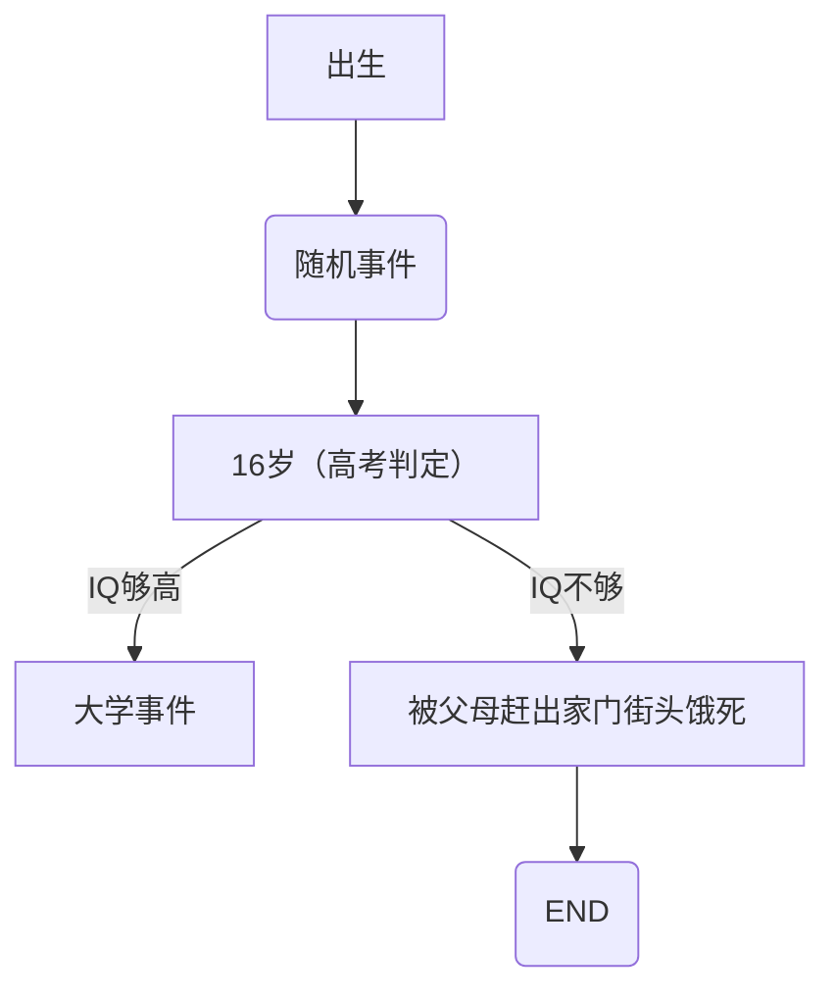

# Simple Event
### Status
- IQ
- Luck
- ATK
- Healthy
- Money
- Skill [ ]

```mermaid
graph TD;
    A["出生"]-->B("随机事件");
    B-->C["16岁（高考判定）"];
    C-- IQ够高 -->E["大学事件"]
    C-- IQ不够-->D["被父母赶出家门街头饿死"];
    D-->F("END")
```